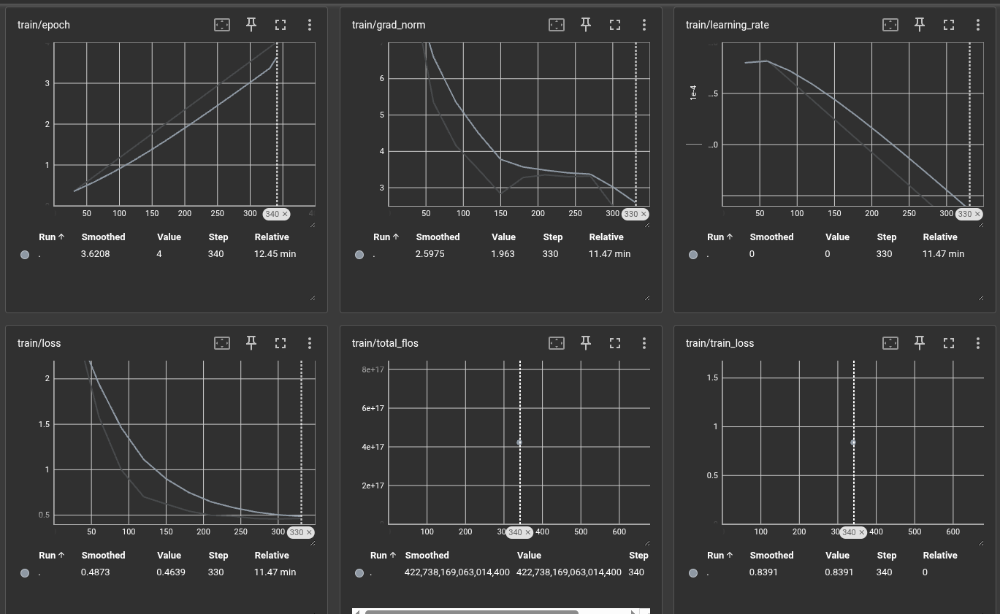

# Fine-Tuning Vision Transformer на Fashion-MNIST

## Студент: Шайдуров Даниил Сергеевич

## Архитектура и гиперпараметры

### Модель
- **Базовая архитектура**: Vision Transformer (ViT) - `WinKawaks/vit-small-patch16-224`
- **Стратегия fine-tuning**: Заморозка энкодера, обучение только головы классификатора
- **Адаптация головы**: Замена классификатора с 1000 (ImageNet) на 10 классов (Fashion-MNIST)

### Обработка изображений
- Изображение делится на патчи 16×16 пикселей
- 224×224 → 14×14 патчей (всего 196 патчей)
- Линейная проекция в эмбеддинг-пространство

### Кодирование входа
- Обучаемый [CLS] токен для классификации
- Позиционные эмбеддинги добавляются к патчам
- Итоговый вход: `[CLS] + эмбеддинги_патчей + позиционные_эмбеддинги`

### Transformer блоки
- Многоголовое самовнимание (Multi-Head Attention)
- MLP слой с активацией GELU
- Layer Normalization

### Голова классификации
- Эмбеддинг [CLS] токена для предсказания
- Линейный классификационный слой
- Выход: вероятности классов

### Гиперпараметры
- **Learning rate**: 2e-4 с линейным затуханием
- **Batch size**: 32
- **Эпохи**: 5
- **Оптимизатор**: AdamW
- **Размер изображений**: 224×224 (ресайз с 28×28)

### Датасет
- **Fashion-MNIST**: 10 классов одежды
- **Размеры выборок** (уменьшил количество элементов в датасете для ускорения обучения в учебных условиях):
  - Train: 5,400 изображений
  - Validation: 600 изображений  
  - Test: 1,000 изображений

## Графики обучения

### train 

### test 

## Выводы

### Стабильность обучения
**Обучение прошло исключительно стабильно**:
- Плавное экспоненциальное снижение потерь от 2.42 до 0.72
- Норма градиентов стабильно уменьшалась с 8.68 до 1.96
- Learning rate корректно затухал
- Отсутствие признаков переобучения

### Качество модели
**Transfer learning показал высокую эффективность**:
- Модель успешно адаптирована с ImageNet на Fashion-MNIST
- Несмотря на заморозку параметров, достигнута точность 85.60%
- ViT Small демонстрирует хорошую трансферную способность

## Возможные улучшения

### Немедленные (минимальные затраты):
1. **Увеличение эпох** до 5-8 для потенциального роста точности до 90%+
2. **Разморозка последних слоев** энкодера для более глубокой адаптации

### Среднесрочные:
1. **Использование ViT Base** для сравнения производительности
2. **Добавление аугментаций** данных (повороты, смещения)
3. **Подбор learning rate** с помощью learning rate finder

### Долгосрочные:
1. **Поэтапное размораживание** слоев энкодера
2. **Использование полного датасета** (60K тренировочных изображений)
3. **Эксперименты с различными scheduler'ами**

## Заключение

Fine-tuning ViT Small на Fashion-MNIST продемонстрировал отличную эффективность: при обучении всего 0.02% параметров модели достигнута точность 85.60%. Подход идеально подходит для задач с ограниченными вычислительными ресурсами, показывая отличный баланс между качеством и скоростью обучения.